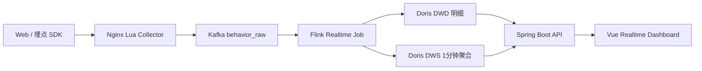
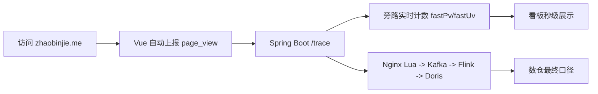

# 用户行为分析实时数仓 Demo

一套面向求职展示的用户行为分析系统 Demo，覆盖埋点接入、消息缓冲、实时计算、分析存储、后端查询和前端看板。

在线地址：

- 个人首页：https://zhaobinjie.me
- 实时数仓 Demo：https://zhaobinjie.me/bigdata

## 项目亮点

- 完整链路：Nginx Lua -> Kafka -> Flink -> Doris -> Spring Boot -> Vue。
- 实时计算：事件时间、Watermark、分钟窗口聚合、状态去重、迟到数据侧输出。
- 数仓分层：DWD 明细、DWS 分钟聚合、ADS 转化漏斗。
- 秒级指标：个人首页访问 PV/UV 通过旁路实时计数快速展示，Flink/Doris 保留最终数仓口径。
- 批量造数：前端可触发造数，观察 Nginx/Kafka、Flink、Doris 各阶段进度。
- 云端部署：新加坡轻量入口机负责域名和 HTTPS，国内 8C32G 服务器承载后端和大数据组件。

## 仓库结构

```text
bigdata-user-behavior-analytics/
├── bigdata-webapp/      # Vue 3 + Vite + ECharts 前端
├── bigdata-backend/     # Java 17 + Spring Boot 后端
├── bigdata-etl/         # Kafka + Flink + Doris + Nginx Lua 实时链路
├── docs/                # 顶层架构与部署文档
└── scripts/             # 预留运维脚本目录
```

## 技术栈

- 前端：Vue 3、Vite、TypeScript、ECharts、lucide-vue-next
- 后端：Java 17、Spring Boot 3、JDBC、Doris MySQL 协议
- 大数据：Nginx Lua、Kafka、Flink、Doris
- 部署：Linux、Docker、Nginx、systemd、Let's Encrypt

## 核心链路



首页访问 PV/UV 使用旁路实时计数：



## 本地构建

前端：

```bash
cd bigdata-webapp
npm install
npm run build
```

后端：

```bash
cd bigdata-backend
export JAVA_HOME=$(/usr/libexec/java_home -v 17 2>/dev/null || echo "$JAVA_HOME")
mvn test
```

大数据端：

```bash
cd bigdata-etl
mvn -DskipTests package
```

## 快速启动说明

完整 Demo 依赖 Kafka、Doris、Flink、Nginx Lua 和 Spring Boot。推荐先阅读：

- [架构说明](docs/architecture.md)
- [部署说明](docs/deploy.md)

## 安全说明

仓库不包含任何服务器密码、SSH 密钥、云账号 AccessKey 或生产配置。所有真实部署参数请通过环境变量或私有配置文件注入。
